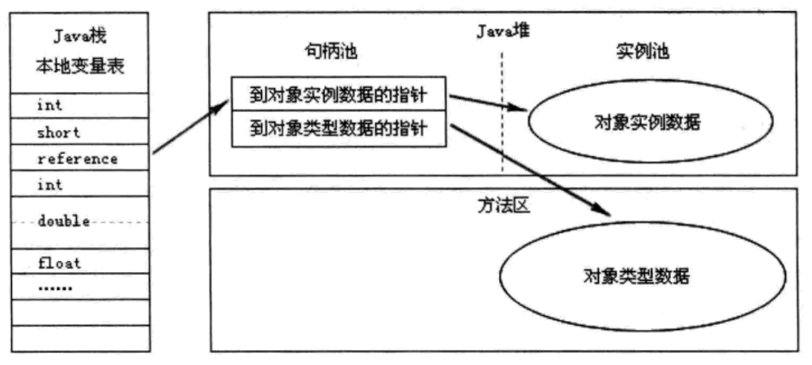
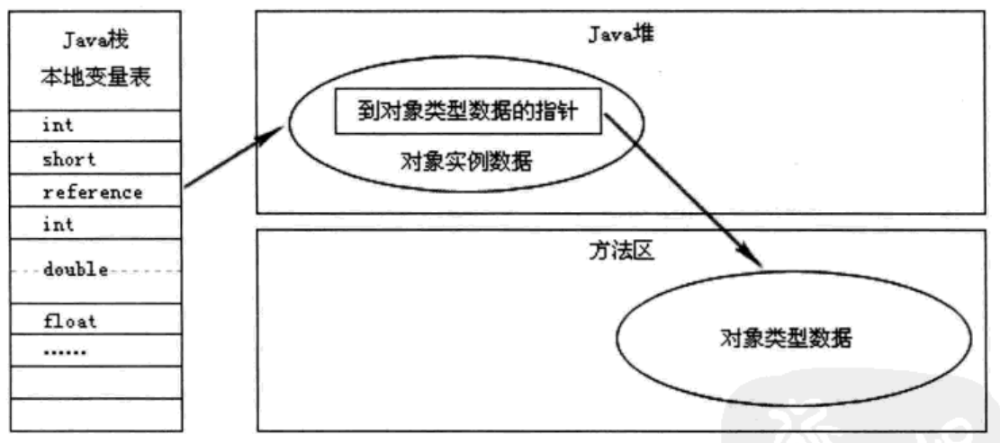

### 190224

* Java技术体系包括以下几个部分：
  * Java编程语言
  * Java标准类库
  * 来自商业机构或开源社区的第三方类库
  * JVM
  * .class文件结构
其中，Java编程语言、Java标准类库和JVM称为JDK；Java标准类库和JVM称为JRE。

* Java程序在运行时，内存分为如下几个区域：
  * 程序计数器，当某个线程执行字节码指令时，通过计数器选取下一条指令。程序计数器是线程私有的，而且在native方法执行过程中，程序计数器是不存在的，因为程序计数器只能用于指示**字节码指令**的位置。
  * 虚拟机栈，也是线程私有的，生命周期和线程一样。它用来描述Java方法的内存模型，方法开始和结束就对应了一个栈帧在虚拟机栈中的push和pop。栈帧是方法运行期的基础数据结构，用来保存方法的出入口信息、方法中的局部变量等等，之前经常听到的“对象保存在堆，变量保存在栈”这种说法，其中的“栈”，指的就是虚拟机栈中的保存局部变量的那一部分（也就是局部变量表，或者称本地变量表）。局部变量表中不仅可以保存8中基本类型的值，还可以保存reference类型和returnAddress（字节码指令地址）类型。long和double占用两个单位空间，其他类型都是占用一个单位。对于一个完全确定的Java方法，它所需要的局部变量表的大小也是确定的，所以局部变量表的大小在编译期间就能确定，而且这个大小在运行期不会变。虚拟机栈可能会出现两种异常，一个是喜闻乐见的StackOverflowError，写递归的时候容易出现。从虚拟机栈的角度来说，就是栈中放了太多的栈帧（方法层级太多了）或一个帧太庞大了（局部变量太多了），超出了栈最大字节数；还有就是OutOfMenoryError，往栈中push栈帧的时候，如果栈太短，就要找内存扩展，如果找不到可用的内存，就出现该错误。
  * 本地方法栈，它的作用和虚拟机栈相似，只不过虚拟机栈给Java方法提供服务，而本地方法栈给native方法提供服务。不同的虚拟机对本地方法栈有不同的实现，甚至有虚拟机将两个栈合二为一。
  * 堆，最大也是最重要的一块区域，被所有线程共享，虚拟机启动时创建，作用是保存对象实例和数组，GC管的也正是这一块区域。从GC角度看，堆还可以细分（怎么分以后会学到）。从内存分配的角度看，堆中会分出一部分空间给线程私有，也就是线程私有的分配缓冲区了。堆可以在物理上不连续，跟链表一样，逻辑上连续即可，堆的大小在运行期是可变的，如果堆爆满需要扩展，但又找不到可用的内存扩展，就会出OutOfMemoryError错误。
  * 方法区，用于保存已被虚拟机加载的类、常量、静态变量和字节码指令等数据。垃圾回收行为在这个区也有，但是很少，主要针对类型的卸载和常量池的回收。和堆一样可以物理上不连续，一样会抛OutOfMemoryError错误。
    * .class文件中除了有类信息，还有常量部分，记录了编译后产生的各种字面量和符号引用。在类加载后，会把这部分数据写到**运行时**常量池中，运行时常量池是方法区中的一部分。运行时常量池可以在运行时动态扩展，也就是说，运行时可以动态产生新的常量，并保存在运行时常量池中（.class文件中没有）。举个栗子，`"hello world"`这种通过字面值定义的字符串对象，就会被记录在.class文件中，并在运行时写入到运行时常量池中，就算代码中有一千次一万次`"hello world"`，该字符串对象在常量池中也只有一个，所以字符串字面值是可以直接用`==`比较的，但是`new String("hello world")`这种字符串对象不行！！其实字符串比较最稳妥的肯定不会错的方式还是用equals方法。关于动态操作运行时常量池，可以了解一下String类的intern()方法，用到不多，其实就是在运行时常量池中查找指定的字符串，找到就返回，找不到就往池里加，再把池中新加的字符串的引用返回。
  * 直接内存，直接内存其实是在虚拟机外，是native内存，但堆中可以创建一个DirectByteBuffer对象来引用和操作直接内存，这种高端玩法在某些情况下可以显著提高性能，比如NIO。同理直接内存也会OutOfMemoryError。

* 访问Java对象的两种方式：
  * 通过句柄访问，这个图说的很清楚了：
    
    好处是移动对象的时候，改句柄中的*到对象实例数据的指针*就行了，其他都不用改；坏处是多了一次指针定位的开销。
  * 通过指针访问，比较直接，上图：
    
    好处是比较快，一次定位就能找到，坏处是移动对象的时候要去本地变量表里改reference。HotSpot用的是这种方式。

### 190225

* 设置JVM参数：java [JVM参数] 字节码文件 [命令行参数]
* JVM参数：
  * -Xms1000m：堆最小为1000M。
  * -Xmx1000m：堆最大为1000M，-Xms和-Xmx这两个设置为一样可以使堆的大小固定，不可扩展。
  * -XX:+HeapDumpOnOutOfMemoryError：出现OutOfMemoryError错误时，给堆拍个照保存下来事后分析，可以用JProfiler或MAT之类的内存映像分析工具分析。
  * -Xss128k：虚拟机栈最长为128k字节，HotSpot虚拟机不区分虚拟机栈和本地方法栈。
* 导致OOM的深层次原因主要有两个：
  * 内存溢出：说白了就是内存不够用了，可以通过JVM参数把堆调整到更大，或者给机器换个大一点的内存:)，或者优化一下，缩短一些对象的生命周期，尽快把内存腾出来给别人用。
  * 内存泄露：一些对象已经没有用了，已经是垃圾了,却由于种种原因没有清理掉，这样的垃圾越积越多，可用内存就越来越少，然后就OOM了。