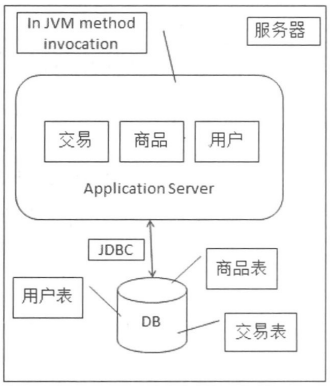
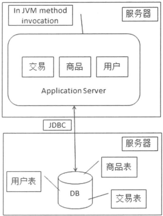
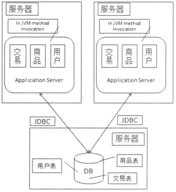
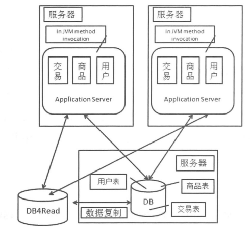
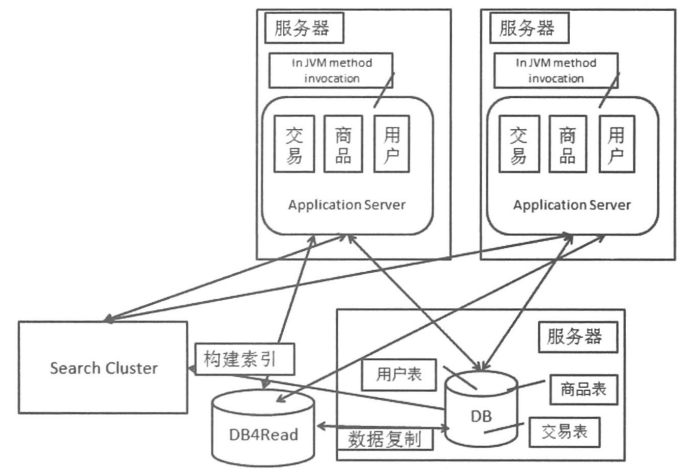

### 分布式系统概要

#### 特点

* 组件分布在多台网络计算机上
* 组件之间仅仅通过**消息传递**来通信并协调行动

#### 单机系统5要素

* 输入设备
* 输出设备
* 运算器
* 控制器
* 存储器：
  * 内存（掉电丢失数据）
  * 外存（掉电不丢失数据）

#### 线程和进程的执行模式

##### 多线程

* 不进行任何交互
* 基于共享容器的交互模式
  * 线程安全容器
  * 线程不安全容器：加锁或写时复制（copy on write）
    * 写时复制：当向容器中写入元素时，先将容器复制，再在副本中写入，最后将原容器的引用指向副本。写时复制的好处是读的时候不用加锁。写时复制也是一种读写分离的思想。
* 基于事件的交互模式：线程A只有在某一事件发生时才能继续运行，而这一事件与线程B有关。这种模式下要注意避免死锁，可以通过调整多个锁的获取顺序，或原子性地获取所有锁。

##### 多进程

多进程和多线程的区别：
* 线程间可以共享内存，进程不可以。
* 多进程的情况下，单个进程出现问题可能会导致整体不可用。但是分布式系统可以看作是多机多进程的系统，如果处理得当，单个进程的问题不会影响整体。
* 进程间通信要复杂一些，涉及到序列化和反序列化。

#### 各种模式下的可用性分析

* 单进程：可用性最差，机器故障、OS问题或进程本身的问题都会导致功能的整体不可用。
* 单机多进程：机器故障和OS问题会导致功能的整体不可用，某个进程出现问题可能会导致部分功能不可用，取决于具体设计。
* 多机：可用性最好，即便是机器故障和OS问题，也能保证系统大体上可用。

### 网络通信基础

#### TCP/IP四层结构

* 应用层
* 传输层
* 网络层
* 链路层

#### 网络IO的实现方式

* BIO：也就是阻塞IO，当服务器端收到一个新的套接字，就要准备一个线程来专门处理，包括建立连接和读写，建立连接和读写操作也是阻塞的。

* NIO：也就是非阻塞IO，基于事件驱动思想，采用**Reactor模式**。NIO中有三个重要概念，分别是**Channel（通道）**，**Buffer（缓冲区）**和**Selector（选择器）**。
  * 通道类似于BIO中的流，不过流是单向的，通道是双向的。
  * 对通道进行读写只能通过缓冲区，缓冲区其实就是个数组，支持多种基本数据类型，对于网络IO，用的最多的还是字节缓冲区，也就是字节数组。关于缓冲区的几个概念：
    * capacity：数组长度。
    * position：当前游标位置。
    * limit：第一个不允许读写的位置，也就是说，该位置前的数据是有效的，该位置后的数据是无意义的。

    ```
    // Java NIO 向文件写数据示例
    File file = new File("data");
    try (FileOutputStream outputStream = new FileOutputStream(file)) {
        FileChannel channel = outputStream.getChannel();
        ByteBuffer buffer = ByteBuffer.allocate(64);
        buffer.put("java nio".getBytes());
        buffer.flip();
        channel.write(buffer);
        channel.close();
    }

    // Java NIO 从文件读数据示例
    File file = new File("data");
    try (FileInputStream inputStream = new FileInputStream(file)) {
        FileChannel channel = inputStream.getChannel();
        ByteBuffer buffer = ByteBuffer.allocate(64);
        channel.read(buffer);
        buffer.flip();
        // 对buffer进行操作
    }
    ```

  * 选择器以单线程的方式管理一组注册其中的通道（SelectableChannel）。

  * Reactor模式伪代码：

    ```
    while (true) {
        selector.select(); // 选出若干IO就绪的通道（阻塞，单线程）
        // selectedKey 表示选择器和通道的关联关系，可以理解为代表了通道本身
        for (selectedKey in selector.selectedKeys()) {
            if (selectedKey.isAcceptable()) { // accept 就绪
                // 一般的处理方式是accept一个client socket channel，再注册到selector
                handleAcceptEvent(selectedKey);
            } else if (selectedKey.isReadable()) { // 读就绪
                handleReadEvent(selectedKey); // 读数据
            } else if (selectedKey.isWritable()) { // 写就绪
                handleWriteEvent(selectedKey); // 写数据
            }
            // 从selectedKeys集合中删除，依然还在selector中
            removeFromSelectedKeys(selectedKey);
        }
    }
      
    ```

    Reactor模式最大的优势就是少量线程甚至单线程就能管理大量网络连接。

* AIO：也就是异步IO，采用Proactor模式，AIO在进行读写操作时，只需要调用相应方法并传入CompletionHandler，在动作异步完成后会回调CompletionHandler。Java在JDK7引入AIO，主要增加了三个异步通道：AsynchronousFileChannel、AsynchronousSocketChannel和AsynchronousServerSocketChannel。

### 从单机到分布式

#### 输入设备的变化

* 传统的人机交互设备
* 接收其他节点传来的信息时，该节点可以看作输入设备

#### 输出设备的变化

* 传统的人机交互设备
* 向其他节点传信息时，该节点可以看作输出设备

#### 控制器的变化

在分布式系统中，控制器不是具体的电子元件，而是一种抽象的控制方式。控制器的主要作用就是**控制和协调节点之间的动作和行为**。

* 使用负载均衡的远程调用：请求发起方和请求处理方之间有一个负载均衡系统（可以是硬件也可以是软件），所有请求都要经过这个负载均衡系统来完成请求转发的控制。这种方式又称为**透明代理**，发起方和处理方都不知道对方的存在。这种方式有两点不足：一是增加了网络流量和延时，二是负载均衡系统出现问题，所有请求都会受到影响。

* 使用名称服务直连的远程调用：名称服务收集若干服务提供者的地址信息，服务消费者获取这些地址信息后，自行进行负载均衡工作，然后直接连接到某一服务提供者。Eureka采用的就是这种方式。

* 使用规则服务直连的远程调用：服务消费者从规则服务那里获取路由规则，根据路由规则选择并直接连接某一服务提供者。规则服务和服务提供者不交互。这种方式可能会导致负载不均衡。

* Master-Worker：Master节点管理任务，分配任务给不同的Worker处理。

#### 运算器的变化

在分布式系统中，运算器不是具体的电子元件，而是由多个节点组成的。单机的计算能力有限，分布式系统中的运算器利用多个节点的计算能力协同完成整体的计算任务。举个栗子，一个网站有两台服务器支撑，那用户需要访问哪台服务器呢？有两种方式：

* 用户在解析DNS的时候，DNS服务通过负载均衡返回某一台服务器的地址
* DNS永远返回负载均衡器的地址，所有请求都必须通过负载均衡器分派到某一服务器上

构成运算器的多个节点在控制器的配合下对外服务。

#### 存储器的变化

在分布式系统中，需要把多个承担存储任务的节点通过控制器组织在一起，使之成为“一个”存储器。以Key-Value存储服务器为例，有四种组织方式：

* 应用服务器不直接联系存储服务器，中间加一层代理服务器，用于请求转发，转发策略一般是根据Key划分。

* 使用名称服务直连的方式。

* 使用规则服务直连的方式。

* 使用Master-Worker方式，应用服务请求Master节点，Master节点通过负载均衡返回某一存储器（Worker）的地址，然后应用服务直接请求那个地址。

### 分布式系统的难点和挑战

* 缺乏全局时钟。
* 面对故障独立性：故障独立性就是分布式系统容易出现一部分没问题，一部分故障的情况。
* 处理单点故障：如果某个功能或某个角色只有某台单机在支撑，则这台单机称为单点，其发生故障称为单点故障。分布式系统中要尽量避免单点，尽量保证功能都是由集群完成的。除了把单点变成集群，还可以对单点进行备份，降低单点故障的影响范围等。
* 事务问题。

### 大型网站的特点

* 高访问量
* 大数据量
* 业务复杂

### 大型网站的架构演进

#### Java单机架构



* 功能模块之间通过JVM方法调用，非远程调用
* 应用直接通过JDBC操作数据库

#### 应用与数据库分离



#### 应用从单机变为集群



* 两个问题：
  * 用户选择哪台服务器的问题（负载均衡、规则服务、名称服务、Master-Worker）。
  * Session问题，在引入负载均衡网关的情况下，有如下解决方法：
    * Session Sticky：负载均衡器能够根据请求的会话标识（比如Cookie）进行请求转发。这种方法有3个问题，一是一台服务器宕机，这台机器上的会话数据就会全部丢失；二是负载均衡器进行请求转发的性能开销变大；三是负载均衡器要维护*会话-服务器*映射，从无状态变为有状态，内存开销增大，而且一旦负载均衡器宕机，所有映射数据都会丢失。
    * Session Replication：在不同的应用服务器之间同步Session数据。这种方法在集群规模很大时会有严重问题，一是网络带宽的开销大量增加，二是产生大量冗余数据，浪费内存。
    * Session数据集中存储：Session数据和应用服务分离，集中保存在一个地方。这种方法有两个问题，一是读写Session数据引入了网络操作，存在时延和不稳定性；二是保存Session数据的机器或集群出现问题，就会影响整个系统。
    * Cookie Based：将会话数据放在Cookie中传递，也就是说用户的状态由用户自己保存，这种方法的一个具体实现就是Jwt。不过这种方法依然有缺陷，一是带宽开销增加；二是性能开销增大，因为每次都要解析Cookie中的数据；三是不安全，不过可以通过https解决。

#### 数据库读写分离



读写分离并不是将主库分割为读库和写库，而是通过**增加读库来分担主库的读的压力**。数据库系统层面对数据复制提供了有限的支持。读写分离有两点问题：

* 数据复制的时延问题：写入主库后，数据还没有复制到读库时（因为延迟），从读库读到的数据就不是最新的，造成一种写入失败的假象。
* 数据库源的选择问题：写操作是肯定要走主库的，事务中的读也是要走主库的，不在事务中的读需要根据具体业务选择（考虑到数据复制的时延）。

#### 增加站内搜索功能

两种方案：

* 通过SQL的LIKE关键字：效率低下
* 倒排索引：也就是搜索引擎的基本原理了，倒排索引表可以看成是一种广义的读库，引入倒排索引表后的结构：
  

#### 增加缓存
